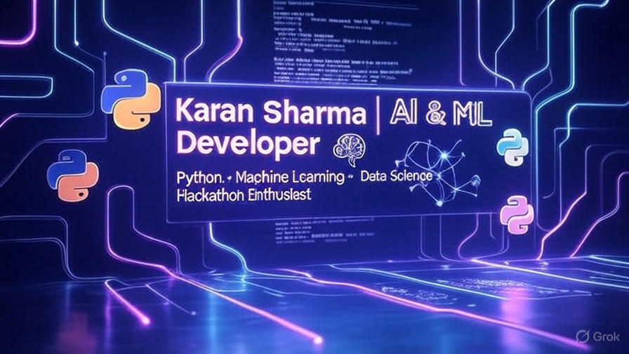

<!-- 🌟 Profile Banner -->

  

<h1 align="center">👋 Hi, I'm Karan Sharma</h1>

  <!-- Profile Badges -->
  
  
  

## 🔹 About Me  

- 🎓 B.Tech CSE (AIML) Student at *CGC Jhanjeri*  
- 📚 Diploma in *Electronics Engineering (SBTE Bihar, 2022–2025)*  
- 🤖 Passionate about *AI, Machine Learning & Hackathons*  
- 🌱 Currently learning: DSA in C++ | ML with Python  
- 💡 Interests: AI/ML, Web Development, Hackathons, Open Source  
- 📫 Reach me: [📧 Gmail](mailto:karanku1882@gmail.com) | [💼 LinkedIn](https://www.linkedin.com/in/karan-sharma-167957271)

## 🛠 Tech Stack  

- Languages:  
    
    
    

- Libraries & Frameworks:  
    
    
    

- Tools & Platforms:  
    
    
  
  
## 📌 Projects   

- 📈 **[Stock Predictor](https://github.com/karan-sharma-aiml/stock-predictor)**  
  ML-based price predictor  
  Tech:  
   
    

- 🤖 **[Vidsnapal – AI Reel Generator](https://github.com/karan-sharma-aiml/vidsnapal)**  
  AI-powered short video (TikTok/Reel) generator  
  Tech:  
   
    

- 🏛 **[CommunityFix](https://github.com/karan-sharma-aiml/communityfix)**  
  Civic issue reporting + ticket management system  
  Tech:  
    

---

## 📈 GitHub Stats  

  
    

  

  
    

  

  
    

  

---

## 📊 Contribution Graph  

  

---

## 🏆 GitHub Trophies  

  

---

## ✨ Fun Section  

  
🌟 "Code. Learn. Grow. Repeat."  

---

## 📫 Connect With Me  

- [LinkedIn](https://www.linkedin.com/in/karan-sharma-aiml/)  
- [GitHub](https://github.com/karan-sharma-aiml)  
- 📧 karanku1882@gmail.com  

---

---

